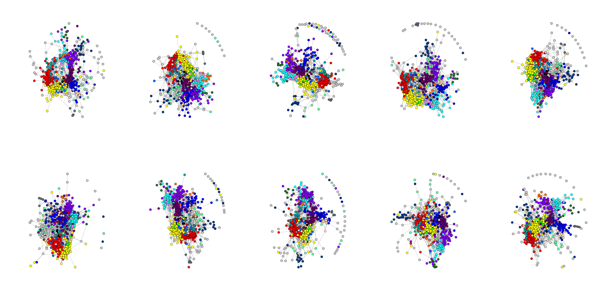
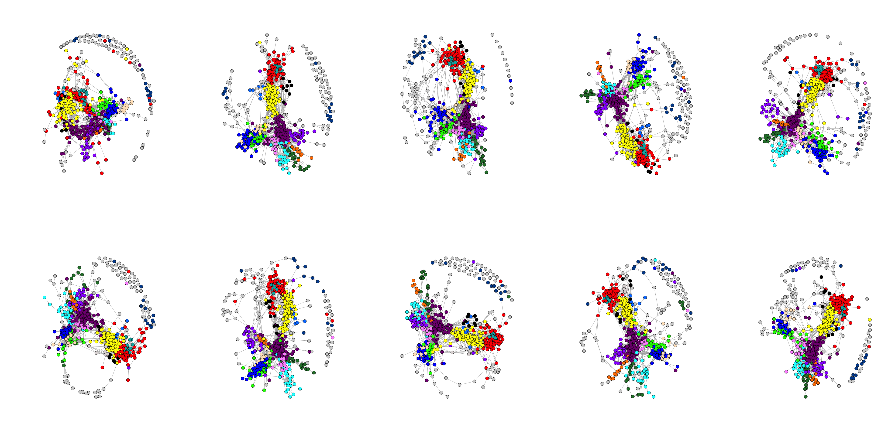
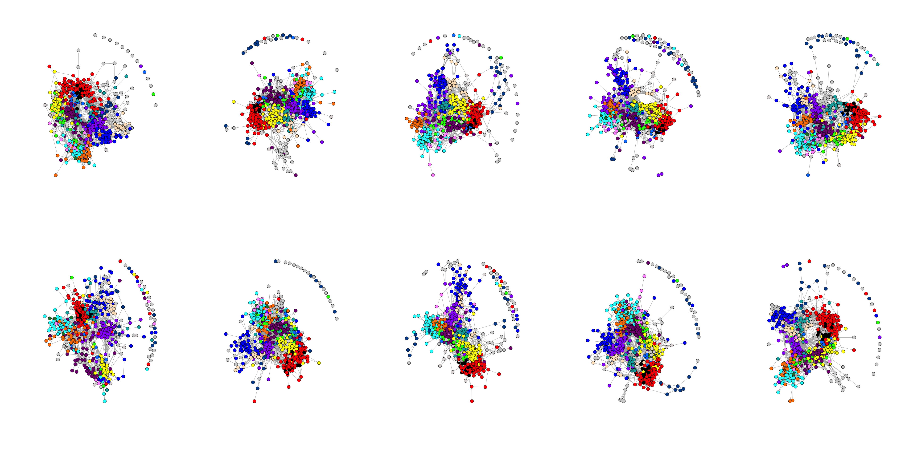
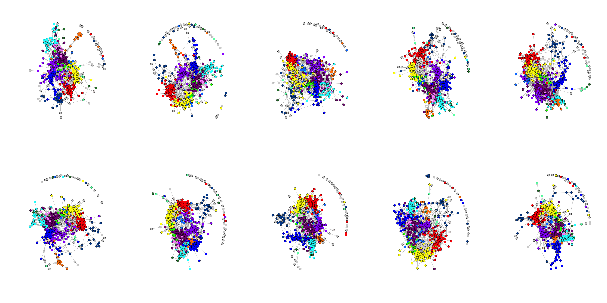
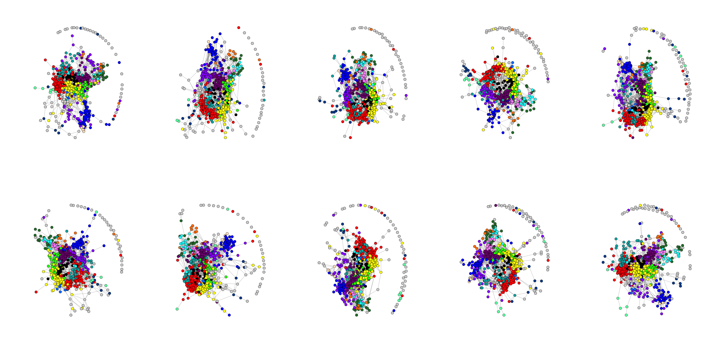
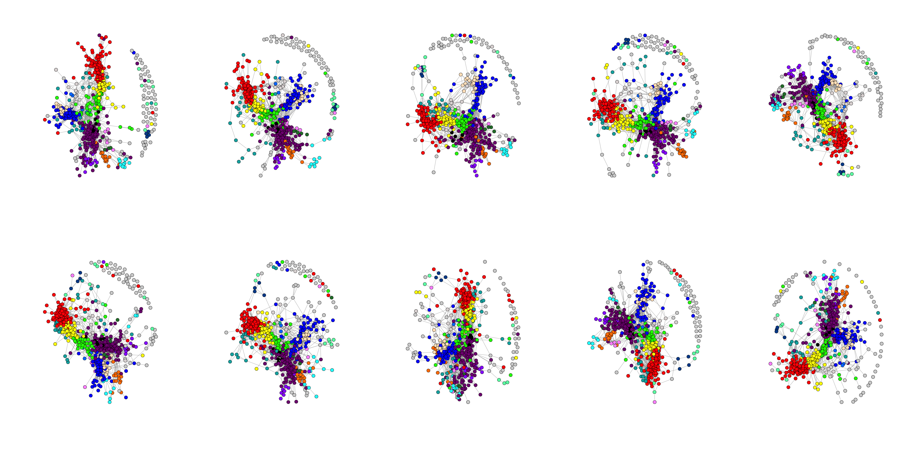
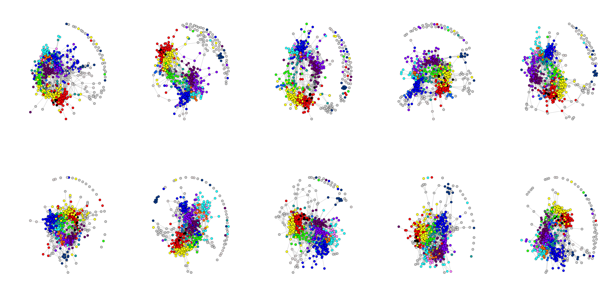
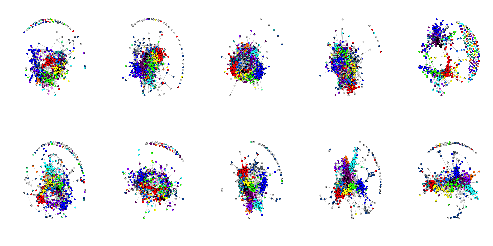
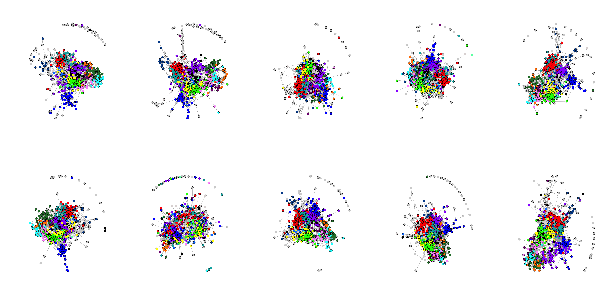
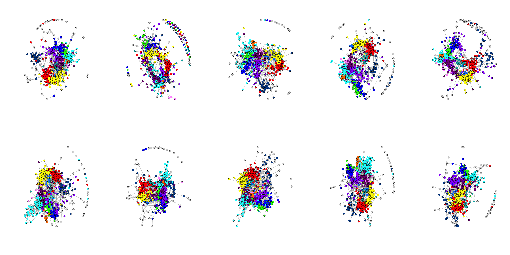

MSC All Subjects RSFC Spring-embedded Graphs - 4% Edge Density
================

<table style="width:72%;">
<colgroup>
<col width="9%" />
<col width="38%" />
<col width="23%" />
</colgroup>
<thead>
<tr class="header">
<th align="center">Comm</th>
<th align="center">Community</th>
<th align="center">CommLabel.short</th>
</tr>
</thead>
<tbody>
<tr class="odd">
<td align="center">0</td>
<td align="center">UnAssign</td>
<td align="center">00Bd</td>
</tr>
<tr class="even">
<td align="center">1</td>
<td align="center">Default</td>
<td align="center">01DMN</td>
</tr>
<tr class="odd">
<td align="center">2</td>
<td align="center">lateral Visual</td>
<td align="center">02lVis</td>
</tr>
<tr class="even">
<td align="center">3</td>
<td align="center">Frontoparietal</td>
<td align="center">03FPN</td>
</tr>
<tr class="odd">
<td align="center">4</td>
<td align="center">medial Visual</td>
<td align="center">04mVis</td>
</tr>
<tr class="even">
<td align="center">5</td>
<td align="center">dorsal Attention</td>
<td align="center">05DAN</td>
</tr>
<tr class="odd">
<td align="center">6</td>
<td align="center">Premotor</td>
<td align="center">06PMo</td>
</tr>
<tr class="even">
<td align="center">7</td>
<td align="center">ventral Attention</td>
<td align="center">07VAN</td>
</tr>
<tr class="odd">
<td align="center">8</td>
<td align="center">Salience</td>
<td align="center">08SLC</td>
</tr>
<tr class="even">
<td align="center">9</td>
<td align="center">Cingular opercular</td>
<td align="center">09CON</td>
</tr>
<tr class="odd">
<td align="center">10</td>
<td align="center">Sensorimotor - hand</td>
<td align="center">10hSMN</td>
</tr>
<tr class="even">
<td align="center">11</td>
<td align="center">Sensorimotor - face</td>
<td align="center">11fSMN</td>
</tr>
<tr class="odd">
<td align="center">12</td>
<td align="center">Auditory</td>
<td align="center">12Aud</td>
</tr>
<tr class="even">
<td align="center">13</td>
<td align="center">anterior Medial temporal</td>
<td align="center">13aMTL</td>
</tr>
<tr class="odd">
<td align="center">14</td>
<td align="center">posterior Medial temporal</td>
<td align="center">14pMTL</td>
</tr>
<tr class="even">
<td align="center">15</td>
<td align="center">Parietal memory</td>
<td align="center">15PMN</td>
</tr>
<tr class="odd">
<td align="center">16</td>
<td align="center">Context</td>
<td align="center">16CAN</td>
</tr>
<tr class="even">
<td align="center">17</td>
<td align="center">Sensorimotor - foot</td>
<td align="center">17fSMN</td>
</tr>
<tr class="odd">
<td align="center">21</td>
<td align="center">Unknown</td>
<td align="center">21UN</td>
</tr>
<tr class="even">
<td align="center">25</td>
<td align="center">Unknown</td>
<td align="center">25UN</td>
</tr>
<tr class="odd">
<td align="center">29</td>
<td align="center">Unknown</td>
<td align="center">29UN</td>
</tr>
<tr class="even">
<td align="center">34</td>
<td align="center">UnKnown</td>
<td align="center">34UN</td>
</tr>
<tr class="odd">
<td align="center">37</td>
<td align="center">UnKnown</td>
<td align="center">37UN</td>
</tr>
</tbody>
</table>

``` r
# read parcel labels for each subject
parcel.comm.path <- "../data/parcel_community"
parcel.list <- lapply(1:length(parcelfile2read), function(x){
                      parcel <- read.table(paste0(parcel.comm.path, parcelfile2read[x]),sep = ",")
                      getVoxDes(parcel,CommName)
                      })
names(parcel.list) <- subj.name

#-- Create colors for heatmap
labelcol <- list()
textcol <- list()
for(i in 1:length(subj.name)){
  labelcol[[i]] <- parcel.list[[i]]$Comm.col$gc[order(rownames(parcel.list[[i]]$Comm.col$gc))]
  names(labelcol)[i] <- subj.name[i]

  textcol[[i]] <- rep("black", length(labelcol[[i]]))
  textcol[[i]][as(colorspace::hex2RGB(labelcol[[i]]), "polarLUV")@coords[,1] < 35] <- "white"  # Convert hex2RGB to lum
}
```

Here are the heatmaps of all 10 sessions arranged by each subject
-----------------------------------------------------------------

``` r
zmat.path <- "../data/zmat"
springlist <- list()
springlist_i <- 1
for(subj.count in 1:length(parcel.list)){
  load(sprintf("%s/sub-MSC%02d_zcube_rcube.RData",zmat.path,subj.count))
  springlist[[subj.count]] <- list()
  for(session.count in 1:dim(cubes$rcube)[3]){
    z <- cubes$rcube[,,session.count]
    z_pos <- z
    z_pos[z_pos<0] <- 0
    ## Threshold matrix to 4%
    z4 <- z_pos
    z4[z < quantile(z, 0.96)] <- 0
    net <- graph.adjacency(adjmatrix = z4, mode = "undirected", diag = F, weighted = T)
    
    V(net)$id <- parcel.list[[subj.name[subj.count]]]$vox.des$NodeID
    V(net)$community <- parcel.list[[subj.name[subj.count]]]$vox.des$Comm
    net <- simplify(net, remove.multiple = F, remove.loops = T) 
    
    springlist[[subj.count]][[session.count]]  <- as.grob(function() plot(net, layout=layout_with_fr, vertex.label=NA, vertex.size=7, vertex.color=parcel.list[[subj.name[subj.count]]]$vox.des$Comm.Col, alpha=.6))
   
    # Remove NA that turns into text labels for nodes
    springlist[[subj.count]][[session.count]]$children$`graphics-plot-1-text-1`$label <- ""
    springlist[[subj.count]][[session.count]]$children$`graphics-plot-1-text-2`$label <- ""
  }
}
```

    ## [1] "sub01"



    ## [1] "sub02"



    ## [1] "sub03"



    ## [1] "sub04"



    ## [1] "sub05"



    ## [1] "sub06"



    ## [1] "sub07"



    ## [1] "sub08"



    ## [1] "sub09"



    ## [1] "sub010"


