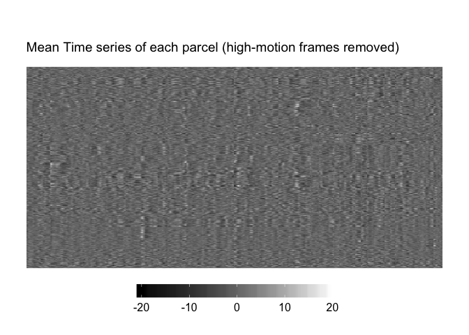
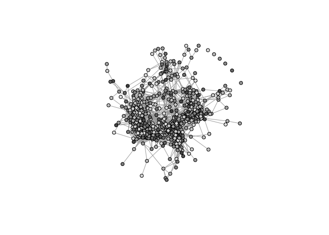
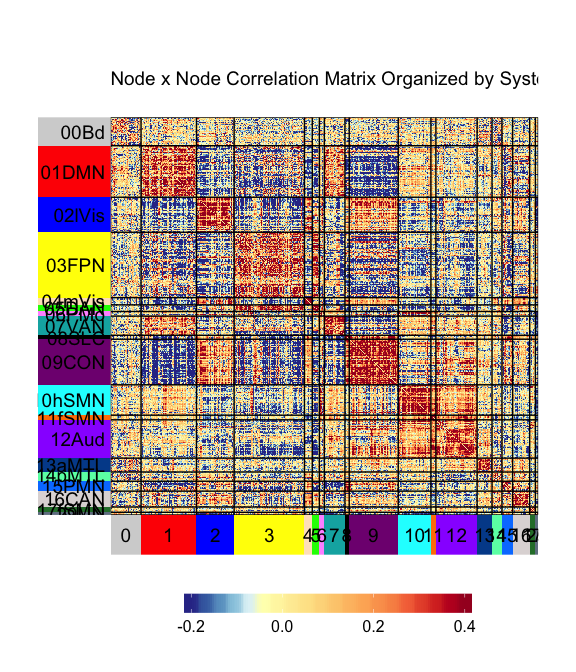
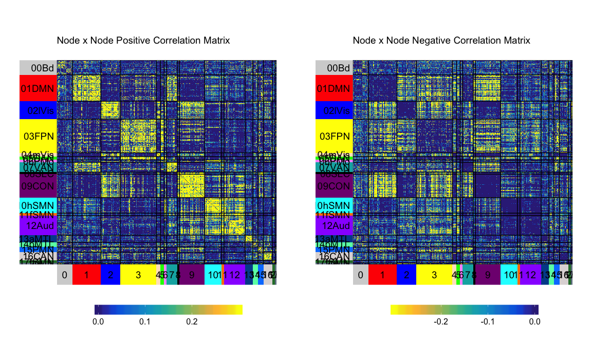
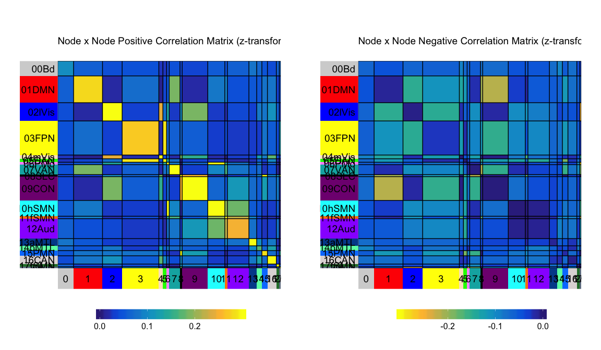
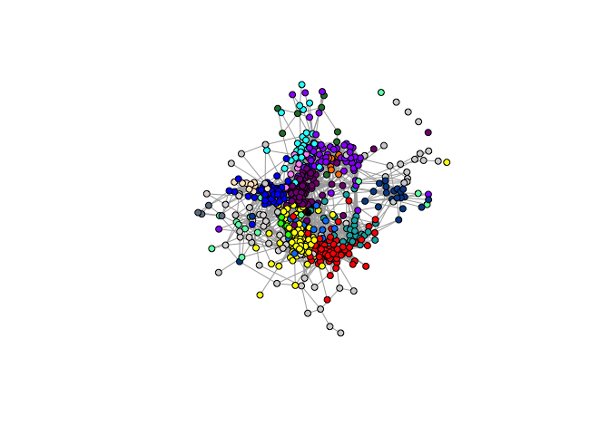
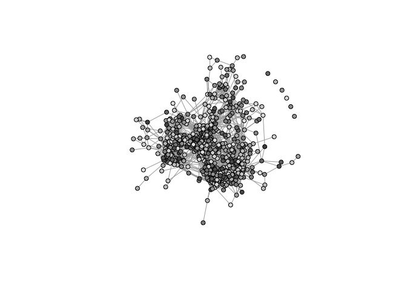
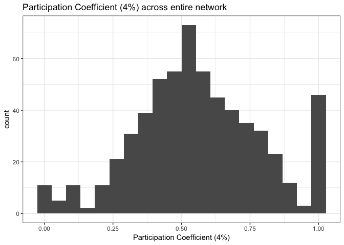

CIFTI in R, MSC single-subject
================
Micaela Chan
June 11, 2019

## Prepare data

  - Requires development version of cifti package:
      - `devtools::install_github("muschellij2/cifti")`
  - Data: Midnight Scanning Club’s first subject’s (MSC-01) data are
    used here.
      - fMRI BOLD data
      - Individual specific parcellation and community (network), which
        is used for assigning parcels into community (i.e., sub-network
        like Default Mode Network)

### Read in cifti files

``` r
# Load CIFTI data files
cii <- read_cifti(mscfile, drop_data = FALSE, trans_data = T) 
parcel <- as.matrix(read_cifti(parcel_file)$data)
comm <- as.matrix(read_cifti(comm_file)$data)

u_parcel <- unique(parcel)
u_parcel <- u_parcel[u_parcel!=0] # Remove parcel 0 and order parcel by their number
```

### Make brainstructure index

The brainstrucure index lets us filter out anatomical structures based
on an index (this mirrors the cifti packages in MATLAB). As of June
2019, the cifti package on CRAN would ignore some subcortical labels, so
make sure to use the development version on github.

``` r
cii$brainstructureindex <- as.matrix(NA, dim(cii$data)[1])
for(i in 1:length(cii$BrainModel)){
  startindx <- attributes(cii$BrainModel[[i]])$IndexOffset + 1
  endindx <- attributes(cii$BrainModel[[i]])$IndexOffset + 
             attributes(cii$BrainModel[[i]])$IndexCount
  
  cii$brainstructureindex[startindx:endindx] <- i
}
```

### Check dimension of cifti data (volume/frame x vertices)

  - Dimension of BOLD, Parcel, and Community:

<!-- end list -->

``` r
dim(cii$data) # ~ 64k vertices, includes subcortical volumes
```

    ## [1] 65890   818     1

``` r
dim(parcel)   # surface only, excluded medial wall
```

    ## [1] 59412     1

``` r
dim(comm)     # surface only, excluded medial wall
```

    ## [1] 59412     1

### Mismatch can be due to inclusion of subcortical/medial wall

CIFTI data contains the surface (cortx left and right) and subcortical
structures based on volumetric data. The labels should contain the left
& right coritcal surface, *AND* subcortical labels.

**What are the labeled brain structures in the BOLD cifti file?**

``` r
cifti_brain_structs(cii)
```

    ##  [1] "CIFTI_STRUCTURE_CORTEX_LEFT"      
    ##  [2] "CIFTI_STRUCTURE_CORTEX_RIGHT"     
    ##  [3] "CIFTI_STRUCTURE_ACCUMBENS_LEFT"   
    ##  [4] "CIFTI_STRUCTURE_ACCUMBENS_RIGHT"  
    ##  [5] "CIFTI_STRUCTURE_AMYGDALA_LEFT"    
    ##  [6] "CIFTI_STRUCTURE_AMYGDALA_RIGHT"   
    ##  [7] "CIFTI_STRUCTURE_CAUDATE_LEFT"     
    ##  [8] "CIFTI_STRUCTURE_CAUDATE_RIGHT"    
    ##  [9] "CIFTI_STRUCTURE_CEREBELLUM_LEFT"  
    ## [10] "CIFTI_STRUCTURE_CEREBELLUM_RIGHT" 
    ## [11] "CIFTI_STRUCTURE_HIPPOCAMPUS_LEFT" 
    ## [12] "CIFTI_STRUCTURE_HIPPOCAMPUS_RIGHT"
    ## [13] "CIFTI_STRUCTURE_PALLIDUM_LEFT"    
    ## [14] "CIFTI_STRUCTURE_PALLIDUM_RIGHT"   
    ## [15] "CIFTI_STRUCTURE_PUTAMEN_LEFT"     
    ## [16] "CIFTI_STRUCTURE_PUTAMEN_RIGHT"    
    ## [17] "CIFTI_STRUCTURE_THALAMUS_LEFT"    
    ## [18] "CIFTI_STRUCTURE_THALAMUS_RIGHT"

Subcortical data are included. Since subcortical data are not sorted
into the community assignments provided by MSC data, only the cortical
surface data will be extracted and
analyzed.

``` r
cdata <- as.matrix(cii$data[cii$brainstructureindex==1 | cii$brainstructureindex==2,,])
```

Check the dimension of the BOLD data again

``` r
dim(cdata)
```

    ## [1] 59412   818

## Remove motion contaminated data

  - Motion contaminated frames/volumes from the data (based on motion
    scrubbing; Power et al. 2012, 2014) is filtered out using a tmask
    file provided with the MSC data.

<!-- end list -->

``` r
tmask <- read.table(tmask_file)$V1
ctmask <- cdata[,as.logical(tmask)]
sprintf("Number of high-motion frames = %s (%s%% removed)", sum(tmask==0), round(sum(tmask==0)/length(tmask)*100))
```

    ## [1] "Number of high-motion frames = 295 (36% removed)"

## Extract mean time series from each parcel into a matrix (node x volume/frame)

``` r
tp <- matrix(0, length(u_parcel), sum(tmask)) # initialize empty matrix

for(i in 1:length(u_parcel)){               
  tp[i,]<- colMeans(ctmask[which(parcel==u_parcel[i]),])
}

tp <- tp[order(u_parcel),] # Order matrix by parcel number
```

## Plot processed mean time series of each node

  - The heatmaps here are generated using a customized version of the
    [superheat (github)](https://github.com/mychan24/superheat) package.

<!-- end list -->

``` r
superheat::superheat(tp,
                     heat.lim = c(-20, 20), 
                     heat.pal = c("black","white"),
                     grid.hline = FALSE,
                     grid.vline = FALSE,
                     title="Mean Time series of each parcel (high-motion frames removed)")
```

<!-- -->

## Correlation Matrix (z-transformed)

``` r
r <- cor(t(tp))         # Correlation matrix between all nodes
z <- psych::fisherz(r)  # Fisher's z-transform: 0.5 * log((1+r)/(1-r))
diag(z) <- 0            # Set diagonal to '0'; not informative

superheat::superheat(z, 
                     y.axis.reverse = TRUE, # This option makes origin (0,0) on top left
                     heat.lim = c(-.2, .4), 
                     heat.pal = rev(brewer.rdylbu(100)), 
                     heat.pal.values = c(0, 0.15, 0.25, 0.75,1),
                     grid.hline = FALSE,
                     grid.vline = FALSE,
                     title="Node x Node Correlation Matrix (z-transformed)")
```

<!-- -->

## Organize the correlation matrix by functional systems

### Setup System Color for Plot

``` r
parlabel <- data.frame(parcel_num=sort(u_parcel), 
                       community=NA, 
                       comm_label=NA, 
                       comm_shortlabel=NA)

plotlabel <- read.csv("../data/systemlabel_MSC.txt", header=F,
                          col.names = c("community","comm_label","color","comm_shortlabel"))

for(i in 1:length(u_parcel)){
  comm_i <- unique(comm[which(parcel==sort(u_parcel)[i])])
  parlabel$community[i] <- comm_i
  parlabel$comm_label[i] <- as.character(plotlabel$comm_label[is.element(plotlabel$community, comm_i)])
  parlabel$comm_shortlabel[i] <- as.character(plotlabel$comm_shortlabel[is.element(plotlabel$community, comm_i)])
}
```

``` r
superheat::superheat(X = z, 
                     y.axis.reverse = TRUE,
                     membership.rows = parlabel$comm_shortlabel,
                     membership.cols = parlabel$community,
                     left.label.col=plotlabel$color,
                     bottom.label.col=plotlabel$color,
                     extreme.values.na = FALSE,
                     heat.lim = c(-.2, .4), 
                     heat.pal = rev(brewer.rdylbu(100)),
                     heat.pal.values = c(0, 0.15, 0.25, 0.75,1),
                     title="Node x Node Correlation Matrix Organized by Systems")
```

<!-- -->

## Splitting negative and positive edges

``` r
# ==== Setup positive matrix plot
z_pos <- z
z_pos[z<0] <- 0
ss_pos <- superheat::superheat(X = z_pos, 
                     y.axis.reverse = TRUE,
                     membership.rows = parlabel$comm_shortlabel,
                     membership.cols = parlabel$community,
                     left.label.col=plotlabel$color,
                     bottom.label.col=plotlabel$color,
                     extreme.values.na = FALSE,
                     heat.lim = c(0, .3), 
                     heat.pal = parula(20),
                     heat.pal.values = c(0, 0.5, 1),
                     title="Node x Node Positive Correlation Matrix")
```

``` r
# ==== Setup negative matrix plot
z_neg <- z
z_neg[z>0] <- 0
ss_neg <- superheat::superheat(X = z_neg, 
                     y.axis.reverse = TRUE,
                     membership.rows = parlabel$comm_shortlabel,
                     membership.cols = parlabel$community,
                     left.label.col=plotlabel$color,
                     bottom.label.col=plotlabel$color,
                     extreme.values.na = FALSE,
                     heat.lim = c(-.3, 0), 
                     heat.pal = rev(parula(20)),
                     heat.pal.values = c(0, 0.5, 1),
                     title="Node x Node Negative Correlation Matrix")
```

``` r
gridExtra::grid.arrange(ggplotify::as.grob(ss_pos$plot), ggplotify::as.grob(ss_neg$plot), 
                        nrow=1)
```

<!-- -->

## Plot smoothed matrix

``` r
ss_smooth_pos <- superheat::superheat(X = z_pos, smooth.heat = T, smooth.heat.type = "mean",
                     y.axis.reverse = TRUE,
                     membership.rows = parlabel$comm_shortlabel,
                     membership.cols = parlabel$community,
                     left.label.col=plotlabel$color,
                     bottom.label.col=plotlabel$color,
                     extreme.values.na = FALSE,
                     heat.lim = c(0, .3), 
                     heat.pal = parula(20),
                     heat.pal.values = c(0, 0.5, 1),
                     title="Node x Node Positive Correlation Matrix (z-transformed")
```

``` r
ss_smooth_neg <- superheat::superheat(X = z_neg, smooth.heat = T, smooth.heat.type = "mean",
                     y.axis.reverse = TRUE,
                     membership.rows = parlabel$comm_shortlabel,
                     membership.cols = parlabel$community,
                     left.label.col=plotlabel$color,
                     bottom.label.col=plotlabel$color,
                     extreme.values.na = FALSE,
                     heat.lim = c(-.3, 0), 
                     heat.pal = rev(parula(20)),
                     heat.pal.values = c(0, 0.5, 1),
                     title="Node x Node Negative Correlation Matrix (z-transformed")
```

``` r
gridExtra::grid.arrange(ggplotify::as.grob(ss_smooth_pos$plot), ggplotify::as.grob(ss_smooth_neg$plot), 
                        nrow=1)
```

<!-- -->

## Plot Positive Netowrk Graph (requires “igraph”)

  - Network is thresholded at 4% edge density

<!-- end list -->

``` r
## Threshold matrix to 4%
z4 <- z_pos
z4[z < quantile(z, 0.96)] <- 0
net <- graph.adjacency(adjmatrix = z4, mode = "undirected", diag = F, weighted = T)

parlabel$id <- 1:nrow(parlabel)
parlabel$color <- NA
u_comm <- unique(parlabel$community)
for(i in u_comm){
  parlabel$color[parlabel$community==i] <- as.character(plotlabel$color[plotlabel$community==i])
}

V(net)$id <- parlabel$id
V(net)$community <- parlabel$community
net <- simplify(net, remove.multiple = F, remove.loops = T) 

pnet <- plot(net, layout=layout_with_fr, vertex.label=NA, vertex.size=5, 
     vertex.color=parlabel$color, alpha=.6)
```

<!-- -->

## Calculate network metrics and plot them (requires “NetworkToolbox”)

### Participation Coefficient (4% edge density)

  - Participation coefficient measures a node’s connections within its
    community proportion to its conncetion to the entire network.

<!-- end list -->

``` r
if (!require("NetworkToolbox", character.only=T, quietly=T)) {
  devtools::install_github("AlexChristensen/NetworkToolbox")
}
```

    ## 
    ## Attaching package: 'NetworkToolbox'

    ## The following objects are masked from 'package:igraph':
    ## 
    ##     betweenness, closeness, degree, diversity, strength,
    ##     transitivity

    ## The following object is masked from 'package:dplyr':
    ## 
    ##     desc

``` r
library(NetworkToolbox)

p <- participation(A = z4, comm = parlabel$community)

# Each node's PC calculated using positive & negative edge
# Negative edges were taken out in previous steps, so PC caculated with all-edges and positive-edges are the same. os
head(p$overall)
```

    ## [1] 0.8375559 0.3965046 0.6669420 0.5441093 0.6031861 0.3480727

``` r
head(p$positive)
```

    ## [1] 0.8375559 0.3965046 0.6669420 0.5441093 0.6031861 0.3480727

``` r
# PC based on negative edges should all be zero (not usable in this case).
head(p$negative)
```

    ## [1] 0 0 0 0 0 0

``` r
# Coloring nodes based on PC.
gcol <- grey.colors(n=nrow(z))
plot(net, layout=layout_with_fr, vertex.label=NA, vertex.size=5, 
     vertex.color=gcol[order(p$positive)], alpha=.6)
```

<!-- -->

### Distribution of participation coefficient across entire network and subnetwork

``` r
parlabel$pc_4td <- p$positive

ggplot(parlabel, aes(x=pc_4td)) +
  geom_histogram(bins=20) +
  xlab("Participation Coefficient (4%)") +
  ggtitle("Participation Coefficient (4%) across entire network") +
  theme_bw()
```

<!-- -->

``` r
ggplot(parlabel, aes(x=pc_4td)) +
  facet_wrap(~comm_shortlabel) +
  geom_histogram(bins = 20) +
  xlab("Participation Coefficient (4%)") +
  ggtitle("Participation Coefficient (4%) across each sub-network") +
  theme_bw()
```

<!-- -->

Use a density plot to visualize distributions where there are small
number of nodes.

``` r
ggplot(parlabel, aes(x=pc_4td)) +
  facet_wrap(~comm_shortlabel) +
  geom_density() +
  xlab("Participation Coefficient (4%)") +
  ggtitle("Participation Coefficient (4%) across each sub-network") +
  theme_bw()
```

<!-- -->

  - 00Bd (UnAssigned) are parcels that don’t belong to any community,
    and likely have very little connections (low degree)
  - Histogram of degree distribution (4% edge density) shows that nodes
    that are UnAssinged have very low
degree

<!-- end list -->

``` r
parlabel$degree_4td <- degree(A = z4) # calculate degree for each node at 4% edge density

ggplot(parlabel, aes(x=degree_4td)) +
  facet_wrap(~comm_shortlabel) +
  geom_histogram(bins = 20) +
  xlab("Degree (4%)") +
  ggtitle("Degree (4%) across each sub-network") +
  theme_bw()
```

<!-- -->
