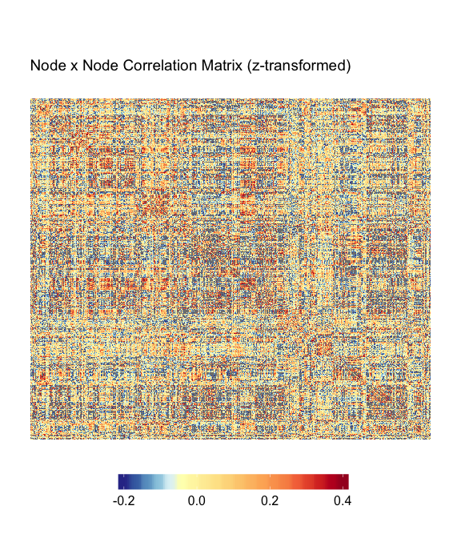
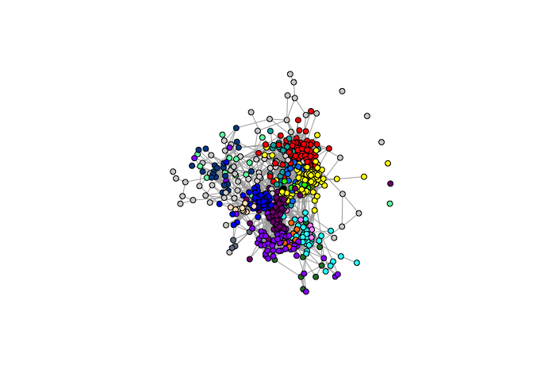
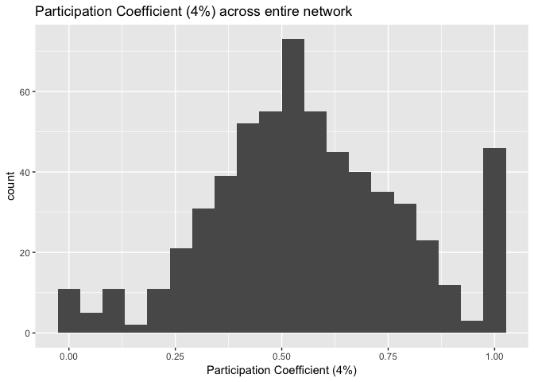
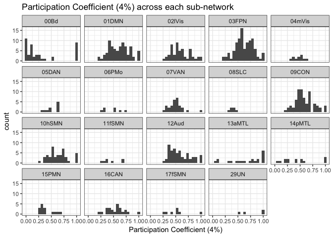

CIFTI in R, MSC single-subject
================
Micalea Chan
4/10/2019

## Read in cifti files

  - Midnight Scanning Club’s first subject’s (MSC-01) data is used
      - Individual specific parcellation and community (network) are
        loaded.

<!-- end list -->

``` r
cii <- read_cifti(mscfile, drop_data = FALSE, trans_data = T) 

# Make brainstructure index
cii$brainstructureindex <- as.matrix(NA, dim(cii$data)[1])
for(i in 1:length(cii$BrainModel)){
  startindx <- as.numeric(attributes(cii$BrainModel[[i]])$IndexOffset + 1)
  endindx <- as.numeric(attributes(cii$BrainModel[[i]])$IndexOffset+attributes(cii$BrainModel[[i]])$IndexCount)
  
  cii$brainstructureindex[startindx:endindx] <- i
}

# Load parcels
parcel <- read_cifti(parcel_file)
parcel <- as.matrix(parcel$data)

# Load community
comm <- read_cifti(comm_file)
comm <- as.matrix(comm$data)
  
# Check dimension of cifti data (volume/frame x vertices)
dim(cii$data) # ~ 64k vertices, includes subcortical volumes
```

    ## [1] 65890   818     1

``` r
dim(parcel)   # surface only, excluded medial wall
```

    ## [1] 59412     1

``` r
dim(comm)     # surface only, excluded medial wall
```

    ## [1] 59412     1

``` r
# What are the labeled brain structures in the cii file? 
cifti_brain_structs(cii)
```

    ##  [1] "CIFTI_STRUCTURE_CORTEX_LEFT"      
    ##  [2] "CIFTI_STRUCTURE_CORTEX_RIGHT"     
    ##  [3] "CIFTI_STRUCTURE_ACCUMBENS_LEFT"   
    ##  [4] "CIFTI_STRUCTURE_ACCUMBENS_RIGHT"  
    ##  [5] "CIFTI_STRUCTURE_AMYGDALA_LEFT"    
    ##  [6] "CIFTI_STRUCTURE_AMYGDALA_RIGHT"   
    ##  [7] "CIFTI_STRUCTURE_CAUDATE_LEFT"     
    ##  [8] "CIFTI_STRUCTURE_CAUDATE_RIGHT"    
    ##  [9] "CIFTI_STRUCTURE_CEREBELLUM_LEFT"  
    ## [10] "CIFTI_STRUCTURE_CEREBELLUM_RIGHT" 
    ## [11] "CIFTI_STRUCTURE_HIPPOCAMPUS_LEFT" 
    ## [12] "CIFTI_STRUCTURE_HIPPOCAMPUS_RIGHT"
    ## [13] "CIFTI_STRUCTURE_PALLIDUM_LEFT"    
    ## [14] "CIFTI_STRUCTURE_PALLIDUM_RIGHT"   
    ## [15] "CIFTI_STRUCTURE_PUTAMEN_LEFT"     
    ## [16] "CIFTI_STRUCTURE_PUTAMEN_RIGHT"    
    ## [17] "CIFTI_STRUCTURE_THALAMUS_LEFT"    
    ## [18] "CIFTI_STRUCTURE_THALAMUS_RIGHT"

``` r
# ==== Take the Left & Right cortex only
cdata <- as.matrix(cii$data[cii$brainstructureindex==1 | cii$brainstructureindex==2,,])
# cdata <- cii$data[,,]
dim(cdata)
```

    ## [1] 59412   818

``` r
u_parcel <- unique(parcel)
u_parcel <- u_parcel[u_parcel!=0] # Remove parcel 0 and order parcel by #
```

## Extract Nodes’ mean time series from surface data

``` r
# ==== Mask out bad volumes from data
tmask <- read.table(tmask_file)$V1
ctmask <- cdata[,as.logical(tmask)]

# ==== Extract mean time series from each parcel -> Parcel x Vol matrix
tp <- matrix(0, length(u_parcel), sum(tmask))   

for(i in 1:length(u_parcel)){               
  tp[i,]<- colMeans(ctmask[which(parcel==u_parcel[i]),])
}

# order by parcel number
tp <- tp[order(u_parcel),]
```

## Plot processed mean time series of each node

  - The heatmaps here are generated using a customized version of the
    [superheat (github)](https://github.com/mychan24/superheat) package.

<!-- end list -->

``` r
superheat::superheat(tp,
                     heat.lim = c(-20, 20), 
                     heat.pal = c("black","white"),
                     grid.hline = FALSE,
                     grid.vline = FALSE,
                     title="Mean Time series of each parcel")
```

<!-- -->

## Correlation Matrix (z-transformed)

``` r
r <- cor(t(tp))         # Correlation matrix between all nodes
z <- psych::fisherz(r)  # Fisher's z-transform: 0.5 * log((1+r)/(1-r))
diag(z) <- 0            # Set diagonal to '0'; not informative

superheat::superheat(z, 
                     y.axis.reverse = TRUE, # Used to make origin (0,0) on top left corner
                     heat.lim = c(-.1, .5), 
                     heat.pal = parula(100),# rev(brewer.rdylbu(100)), 
                     heat.pal.values = c(0, 0.5,1),
                     grid.hline = FALSE,
                     grid.vline = FALSE,
                     title="Node x Node Correlation Matrix (z-transformed)")
```

<!-- -->

## Correlation Matrix, nodes ordered by systems

### Setup System Color for Plot

``` r
parlabel <- data.frame(parcel_num=sort(u_parcel), community=NA)
plotlabel <- read.csv("../data/systemlabel_MSC.txt", header=F,
                          col.names = c("community","comm_label","color","comm_shortlabel"))

for(i in 1:length(u_parcel)){
  parlabel$community[i] <- unique(comm[which(parcel==sort(u_parcel)[i])])
}
```

``` r
superheat::superheat(X = z, 
                     y.axis.reverse = TRUE,
                     membership.rows = parlabel$community,
                     membership.cols = parlabel$community,
                     left.label.col=plotlabel$color,
                     bottom.label.col=plotlabel$color,
                     extreme.values.na = FALSE,
                     heat.lim = c(-.2, .2), 
                     heat.pal = rev(brewer.rdylbu(100)),
                     heat.pal.values = c(0, 0.15, 0.25, 0.75,1),
                     title="Parcel x Parcel Correlation Matrix (z-transformed)")
```

<!-- -->

## Splitting negative and positive edges

``` r
# ==== Setup positive matrix plot
z_pos <- z
z_pos[z<0] <- 0
ss_pos <- superheat::superheat(X = z_pos, 
                     y.axis.reverse = TRUE,
                     membership.rows = parlabel$community,
                     membership.cols = parlabel$community,
                     left.label.col=plotlabel$color,
                     bottom.label.col=plotlabel$color,
                     extreme.values.na = FALSE,
                     heat.lim = c(0, .3), 
                     heat.pal = parula(20),
                     heat.pal.values = c(0, 0.5, 1),
                     title="Node x Node Positive Correlation Matrix (z-transformed")
```

``` r
# ==== Setup negative matrix plot
z_neg <- z
z_neg[z>0] <- 0
ss_neg <- superheat::superheat(X = z_neg, 
                     y.axis.reverse = TRUE,
                     membership.rows = parlabel$community,
                     membership.cols = parlabel$community,
                     left.label.col=plotlabel$color,
                     bottom.label.col=plotlabel$color,
                     extreme.values.na = FALSE,
                     heat.lim = c(-.3, 0), 
                     heat.pal = rev(parula(20)),
                     heat.pal.values = c(0, 0.5, 1),
                     title="Node x Node Negative Correlation Matrix (z-transformed")
```

``` r
gridExtra::grid.arrange(ggplotify::as.grob(ss_pos$plot), ggplotify::as.grob(ss_neg$plot), 
                        nrow=1)
```

<!-- -->

## Plot smoothed matrix

``` r
ss_smooth_pos <- superheat::superheat(X = z_pos, smooth.heat = T, smooth.heat.type = "mean",
                     y.axis.reverse = TRUE,
                     membership.rows = parlabel$community,
                     membership.cols = parlabel$community,
                     left.label.col=plotlabel$color,
                     bottom.label.col=plotlabel$color,
                     extreme.values.na = FALSE,
                     heat.lim = c(0, .3), 
                     heat.pal = parula(20),
                     heat.pal.values = c(0, 0.5, 1),
                     title="Node x Node Positive Correlation Matrix (z-transformed")
```

``` r
ss_smooth_neg <- superheat::superheat(X = z_neg, smooth.heat = T, smooth.heat.type = "mean",
                     y.axis.reverse = TRUE,
                     membership.rows = parlabel$community,
                     membership.cols = parlabel$community,
                     left.label.col=plotlabel$color,
                     bottom.label.col=plotlabel$color,
                     extreme.values.na = FALSE,
                     heat.lim = c(-.3, 0), 
                     heat.pal = rev(parula(20)),
                     heat.pal.values = c(0, 0.5, 1),
                     title="Node x Node Negative Correlation Matrix (z-transformed")
```

``` r
gridExtra::grid.arrange(ggplotify::as.grob(ss_smooth_pos$plot), ggplotify::as.grob(ss_smooth_neg$plot), 
                        nrow=1)
```

<!-- -->

## Plot Positive Netowrk Graph (requires “igraph”)

  - Network is thresholded at 4% edge density

<!-- end list -->

``` r
## Threshold matrix to 4%
z4 <- z_pos
z4[z < quantile(z, 0.96)] <- 0
net <- graph.adjacency(adjmatrix = z4, mode = "undirected", diag = F, weighted = T)

parlabel$id <- 1:nrow(parlabel)
parlabel$color <- NA
u_comm <- unique(parlabel$community)
for(i in u_comm){
  parlabel$color[parlabel$community==i] <- as.character(plotlabel$color[plotlabel$community==i])
}

V(net)$id <- parlabel$id
V(net)$community <- parlabel$community
net <- simplify(net, remove.multiple = F, remove.loops = T) 

pnet <- plot(net, layout=layout_with_fr, vertex.label=NA, vertex.size=5, 
     vertex.color=parlabel$color, alpha=.6)
```

<!-- -->

## Calculate network metrics and plot them (requires “NetworkToolbox”)

### Participation Coefficient (4% edge density)

  - Participation coefficient measures a node’s connections within its
    community proportion to its conncetion to the entire network.

<!-- end list -->

``` r
if (!require("NetworkToolbox", character.only=T, quietly=T)) {
  devtools::install_github("AlexChristensen/NetworkToolbox")
}
```

    ## Warning: package 'NetworkToolbox' was built under R version 3.5.2

    ## 
    ## Attaching package: 'NetworkToolbox'

    ## The following objects are masked from 'package:igraph':
    ## 
    ##     betweenness, closeness, degree, diversity, strength,
    ##     transitivity

    ## The following object is masked from 'package:dplyr':
    ## 
    ##     desc

``` r
library(NetworkToolbox)

p <- participation(A = z4, comm = parlabel$community)

# Each node's PC calculated using positive & negative edge
# Negative edges were taken out in previous steps, so PC caculated with all-edges and positive-edges are the same. 
head(p$overall)
```

    ## [1] 0.8375559 0.3965046 0.6669420 0.5441093 0.6031861 0.3480727

``` r
head(p$positive)
```

    ## [1] 0.8375559 0.3965046 0.6669420 0.5441093 0.6031861 0.3480727

``` r
# PC based on negative edges should all be zero (not usable in this case).
head(p$negative)
```

    ## [1] 0 0 0 0 0 0

``` r
# Coloring nodes based on PC.
gcol <- grey.colors(n=nrow(z))
plot(net, layout=layout_with_fr, vertex.label=NA, vertex.size=5, 
     vertex.color=gcol[order(p$positive)], alpha=.6)
```

<!-- -->

### Distribution of participation coefficient across entire network and subnetwork

``` r
parlabel$pc_4td <- p$positive

ggplot(parlabel, aes(x=pc_4td)) +
  geom_histogram(bins=20) +
  xlab("Participation Coefficient (4%)") +
  ggtitle("Participation Coefficient (4%) across entire network")
```

<!-- -->

``` r
ggplot(parlabel, aes(x=pc_4td)) +
  facet_wrap(~community) +
  geom_histogram(bins = 20) +
  xlab("Participation Coefficient (4%)") +
  ggtitle("Participation Coefficient (4%) across each sub-network")
```

<!-- -->
