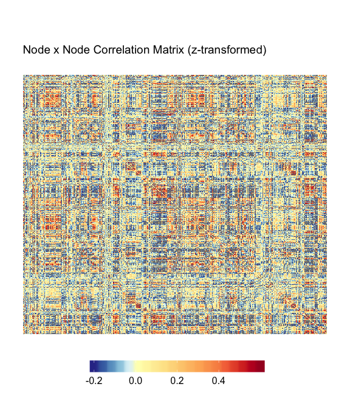

Gifti in R, Network Workflow
================
Micalea Chan
2/5/2019

## Read in files

`gL <- read_gifti('<path to L hemisphere functional data>.func.gii')`
`gR <- read_gifti('<path to L hemisphere functional data>.func.gii')`
`nodeL <- read_gifti('<path to L hemisphere nodes>.func.gii')` `nodeR <-
read_gifti('<path to R hemisphere nodes>.func.gii')` `node_order <-
read_table('Chan_RSFC_Nodes_PNAS2014_metadata.txt', sep="\t", header=T)`

`gL <- as.matrix(data.frame(gL$data))` `gR <-
as.matrix(data.frame(gR$data))` `node_L <-
as.matrix(data.frame(node_L$data))` `node_R <-
as.matrix(data.frame(node_R$data))`

  - Gifti files here are mapped to fs\_LR 32k surfaces.
  - Node sets used can be downloaded from
    [github](https://github.com/mychan24/Chan_RSFC_Nodes)
  - The heatmaps here are generated using a customized version of the
    [superheat (github)](https://github.com/mychan24/superheat) package.

## Setup System Color for Plot

``` r
# ==== Make Color label for heatmap
node_order$Color <- rgb(node_order$Power_red, node_order$Power_green, node_order$Power_blue)

plotlabel <- node_order %>%
  distinct(Power_label, Color) %>%
  arrange(Power_label)
```

## Extract Nodes’ mean time series from surface data

``` r
# sanity check
if(ncol(gL)!=ncol(gR)){
  stop("Column size (# volumes) of left & right hemisphere should be equal. Check input data.")
}

tp_L <- matrix(0, ncol(node_L), ncol(gL))
tp_R <- matrix(0, ncol(node_R), ncol(gR))

for(i in 1:ncol(node_L)){                 # Left Hemipshere
  tp_L[i,]<- colMeans(gL[node_L[,i]==1,])
}

for(i in 1:ncol(node_R)){                 # Right Hemipshere
  tp_R[i,]<- colMeans(gR[node_R[,i]==1,])
}

tp <- rbind(tp_L, tp_R)                   # combine L and R
rm(tp_L, tp_R) # cleanup
```

## Plot processed mean time series of each node

``` r
superheat::superheat(tp,
                     heat.lim = c(-20, 20), 
                     heat.pal = c("black","white"),
                     grid.hline = FALSE,
                     grid.vline = FALSE,
                     title="Mean Time series of each node")
```

<!-- -->

## Correlation Matrix (z-transformed)

``` r
r <- cor(t(tp))         # Correlation matrix between all nodes
z <- psych::fisherz(r)  # Fisher's z-transform: 0.5 * log((1+r)/(1-r))

diag(z) <- 0            # Set diagonal to '0'; not informative

superheat::superheat(z, 
                     y.axis.reverse = TRUE, # Used to make origin (0,0) on top left corner
                     heat.lim = c(-.2, .6), 
                     heat.pal = rev(brewer.rdylbu(100)), 
                     heat.pal.values = c(0, 0.15, 0.25, 0.75,1),
                     grid.hline = FALSE,
                     grid.vline = FALSE,
                     title="Node x Node Correlation Matrix (z-transformed)")
```

<!-- -->

## Correlation Matrix, nodes ordered by systems

``` r
superheat::superheat(X = z, 
                     y.axis.reverse = TRUE,
                     membership.rows = node_order$Power_label,
                     membership.cols = node_order$Power_label,
                     left.label.col=plotlabel$Color,
                     bottom.label.col=plotlabel$Color,
                     extreme.values.na = FALSE,
                     heat.lim = c(-.2, .6), 
                     heat.pal = rev(brewer.rdylbu(100)),
                     heat.pal.values = c(0, 0.15, 0.25, 0.75,1),
                     title="Node x Node Correlation Matrix (z-transformed")
```

<!-- -->

## Splitting Negative and Positive

``` r
# ==== Setup positive matrix plot
z_pos <- z
z_pos[z<0] <- 0
ss_pos <- superheat::superheat(X = z_pos, 
                     y.axis.reverse = TRUE,
                     membership.rows = node_order$Power_label,
                     membership.cols = node_order$Power_label,
                     left.label.col=plotlabel$Color,
                     bottom.label.col=plotlabel$Color,
                     extreme.values.na = FALSE,
                     heat.lim = c(0, .3), 
                     heat.pal = parula(20),
                     heat.pal.values = c(0, 0.5, 1),
                     title="Node x Node Positive Correlation Matrix (z-transformed")
```

``` r
# ==== Setup negative matrix plot
z_neg <- z
z_neg[z>0] <- 0
ss_neg <- superheat::superheat(X = z_neg, 
                     y.axis.reverse = TRUE,
                     membership.rows = node_order$Power_label,
                     membership.cols = node_order$Power_label,
                     left.label.col=plotlabel$Color,
                     bottom.label.col=plotlabel$Color,
                     extreme.values.na = FALSE,
                     heat.lim = c(-.3, 0), 
                     heat.pal = rev(parula(20)),
                     heat.pal.values = c(0, 0.5, 1),
                     title="Node x Node Negative Correlation Matrix (z-transformed")
```

``` r
gridExtra::grid.arrange(ggplotify::as.grob(ss_pos$plot), ggplotify::as.grob(ss_neg$plot), 
                        nrow=1)
```

<!-- -->
