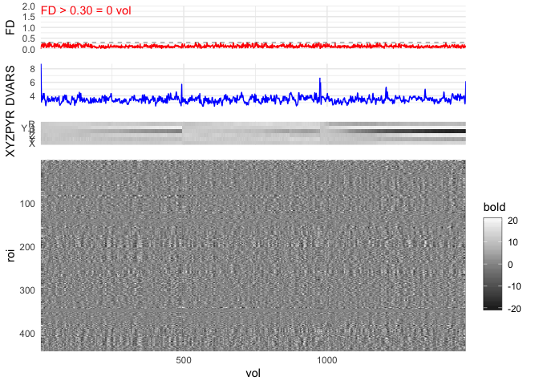
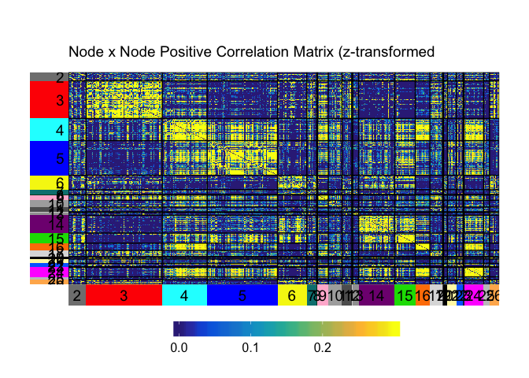

Gifti in R, Network Workflow
================
Micalea Chan
August 22, 2019

## Read in files

  - Gifti files here are mapped to fs\_LR 32k surfaces.
  - Node sets used can be downloaded from
    [github](https://github.com/mychan24/Chan_RSFC_Nodes)

<!-- end list -->

``` r
gL <- read_gifti(gL_file)
gR <- read_gifti(gR_file)

# nodes (L/R): Chan_RSFC_Nodes/gifti_multiple_columns/ROI_L/R_dis8_fwhm0_limit3_overlapEXCLUDE.func.gii
# metadata: Chan_RSFC_Nodes/Chan_RSFC_Nodes_PNAS2014_metadata.txt
node_L <- read_gifti(nodeL_file)    
node_R <- read_gifti(nodeR_file)    
node_order <- read.table(node_meta_table_file, sep="\t", header=T)  


# Load motion/tmask files
fd <- read.table(fd_file, col.names = "FD")
fd$vol <- 1:nrow(fd)

motion <- read.table(motion_file, col.names = c("X","Y","Z","P","Y","R"))
dv <- read.table(dv_file, col.names = "DVARS")
dv$vol <- 1:nrow(dv)

tmask <- read.table(tmask_file, col.names = "tmask")

# Tmask the motion files
fd <- data.frame(fd[as.logical(tmask$tmask),])
motion <- motion[as.logical(tmask$tmask),]
dv <- dv[as.logical(tmask$tmask),]
```

## Extract Nodes’ mean time series from surface data

``` r
# sanity check
gL <- as.matrix(data.frame(gL$data))
gR <- as.matrix(data.frame(gR$data))
node_L <- as.matrix(data.frame(node_L$data))
node_R <- as.matrix(data.frame(node_R$data))

if(ncol(gL)!=ncol(gR)){
  stop("Column size (# volumes) of left & right hemisphere should be equal. Check input data.")
}

tp_L <- matrix(0, ncol(node_L), ncol(gL))
tp_R <- matrix(0, ncol(node_R), ncol(gR))

for(i in 1:ncol(node_L)){                 # Left Hemipshere
  tp_L[i,]<- colMeans(gL[node_L[,i]==1,])
}

for(i in 1:ncol(node_R)){                 # Right Hemipshere
  tp_R[i,]<- colMeans(gR[node_R[,i]==1,])
}

tp <- rbind(tp_L, tp_R)                   # combine L and R
rm(tp_L, tp_R) # cleanup
```

## Plot processed mean time series of each node

  - The heatmaps here is generated using
`geom_raster()`

<!-- end list -->

``` r
g1 <- plot_qc(qc = fd$FD, qc_thres=0.3, qc_name="FD", miny = 0, maxy = 2)
g2 <- plot_qc(qc = dv$DVARS, qc_name="DVARS", qc_color = "blue")
g3 <- plot_motion(motion)
g4 <- plot_time_series(tp, min = 20, max = 20)

plots_aligned <- AlignPlots(g1, g2, g3, g4)
```

    ## Warning: Removed 1 rows containing missing values (geom_path).

    ## Warning in .Primitive("max")(NULL, NULL, NULL, NULL): no non-missing
    ## arguments to max; returning -Inf

``` r
grid.arrange(as.grob(plots_aligned[[1]]), 
             as.grob(plots_aligned[[2]]), 
             as.grob(plots_aligned[[3]]), 
             as.grob(plots_aligned[[4]]), 
             ncol=1, heights=c(0.15,0.15,0.1,0.6))
```

<!-- -->

## Correlation Matrix (z-transformed)

  - The heatmaps here are generated using a customized version of the
    [superheat (github)](https://github.com/mychan24/superheat) package.

<!-- end list -->

``` r
r <- cor(t(tp))         # Correlation matrix between all nodes
z <- psych::fisherz(r)  # Fisher's z-transform: 0.5 * log((1+r)/(1-r))

diag(z) <- 0            # Set diagonal to '0'; not informative

superheat::superheat(z, 
                     y.axis.reverse = TRUE, # Used to make origin (0,0) on top left corner
                     heat.lim = c(-.2, .6), 
                     heat.pal = rev(brewer.rdylbu(100)), 
                     heat.pal.values = c(0, 0.15, 0.25, 0.75,1),
                     grid.hline = FALSE,
                     grid.vline = FALSE,
                     title="Node x Node Correlation Matrix (z-transformed)")
```

<!-- -->

## Correlation Matrix, nodes ordered by systems

### Setup System Color for Plot

``` r
# ==== Make Color label for heatmap
node_order$Color <- rgb(node_order$Power_red, node_order$Power_green, node_order$Power_blue)

plotlabel <- node_order %>%
  distinct(Power_label, Color) %>%
  arrange(Power_label)
```

``` r
superheat::superheat(X = z, 
                     y.axis.reverse = TRUE,
                     membership.rows = node_order$Power_label,
                     membership.cols = node_order$Power_label,
                     left.label.col=plotlabel$Color,
                     bottom.label.col=plotlabel$Color,
                     extreme.values.na = FALSE,
                     heat.lim = c(-.2, .6), 
                     heat.pal = rev(brewer.rdylbu(100)),
                     heat.pal.values = c(0, 0.15, 0.25, 0.75,1),
                     title="Node x Node Correlation Matrix (z-transformed")
```

<!-- -->

## Splitting Negative and Positive

``` r
# ==== Setup positive matrix plot
z_pos <- z
z_pos[z<0] <- 0
ss_pos <- superheat::superheat(X = z_pos, 
                     y.axis.reverse = TRUE,
                     membership.rows = node_order$Power_label,
                     membership.cols = node_order$Power_label,
                     left.label.col=plotlabel$Color,
                     bottom.label.col=plotlabel$Color,
                     extreme.values.na = FALSE,
                     heat.lim = c(0, .3), 
                     heat.pal = parula(20),
                     heat.pal.values = c(0, 0.5, 1),
                     title="Node x Node Positive Correlation Matrix (z-transformed")
```

``` r
# ==== Setup negative matrix plot
z_neg <- z
z_neg[z>0] <- 0
ss_neg <- superheat::superheat(X = z_neg, 
                     y.axis.reverse = TRUE,
                     membership.rows = node_order$Power_label,
                     membership.cols = node_order$Power_label,
                     left.label.col=plotlabel$Color,
                     bottom.label.col=plotlabel$Color,
                     extreme.values.na = FALSE,
                     heat.lim = c(-.3, 0), 
                     heat.pal = rev(parula(20)),
                     heat.pal.values = c(0, 0.5, 1),
                     title="Node x Node Negative Correlation Matrix (z-transformed")
```

``` r
gridExtra::grid.arrange(ggplotify::as.grob(ss_pos$plot), ggplotify::as.grob(ss_neg$plot), 
                        nrow=1)
```

<!-- -->
